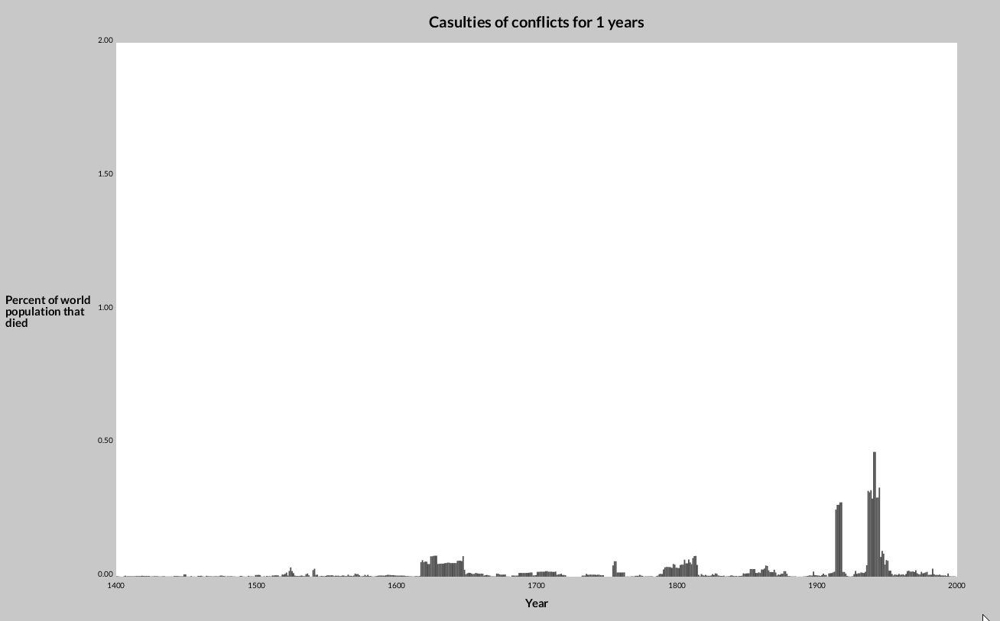

# war-casualties-visualization

## About
We all know that the two World Wars were one of the most devastating conflicts in human history. But how do they compare to previous wars? Is the 20th century truly the most violent period? 

To answer these questions we developed an interactive visualization of conflicts from the 14th to the 20th century with the [Processing](https://processing.org/) programming language, which is aimed at visual design applications. Special attention was given to presenting the data according to Edward Tufte's guidelines [1, 2].

Data is taken from P. Brecke's Conflict catalogue [3] and the UN's Estimate of the historical world population [4]. 

This is a personal assignment project for the Interaction and Information Design course at the University of Ljubljana, Faculty of Computer and Information Science in 2019. File porocilo.pdf contains a more detailed report in the Slovenian language.

## Instructions
By scrolling the mouse wheel, the visualisation you can inspect the casualties of conflicts over the time periods of 1, 5, 10 and 100 years. The height of the bars denotes the percentage of the world population that died. Moving the cursor over a specific bar specifies details about the three largest conflicts of the time period.  

## Literature
[1] Tufte, Edward. "Graphical excellence." The visual display of quantitative information (2001): 13-52.

[2] Tufte, E.R.: The Visual Display of Quantitative Information. Graphics Press,
Cheshire, CT, USA (1986)

[3] Brecke, P.: Conflict catalog (http://brecke.inta.gatech.edu/research/conflict/)

[4] United Nations.: The world at six billion (https://www.un.org/development/desa/pd/content/world-six-billion)
